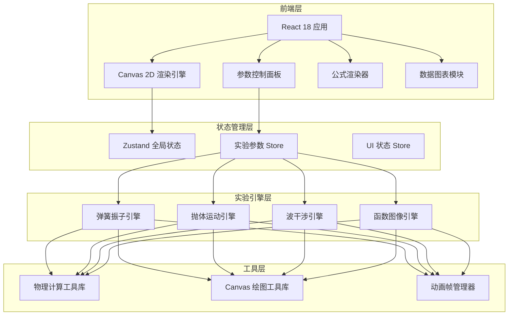
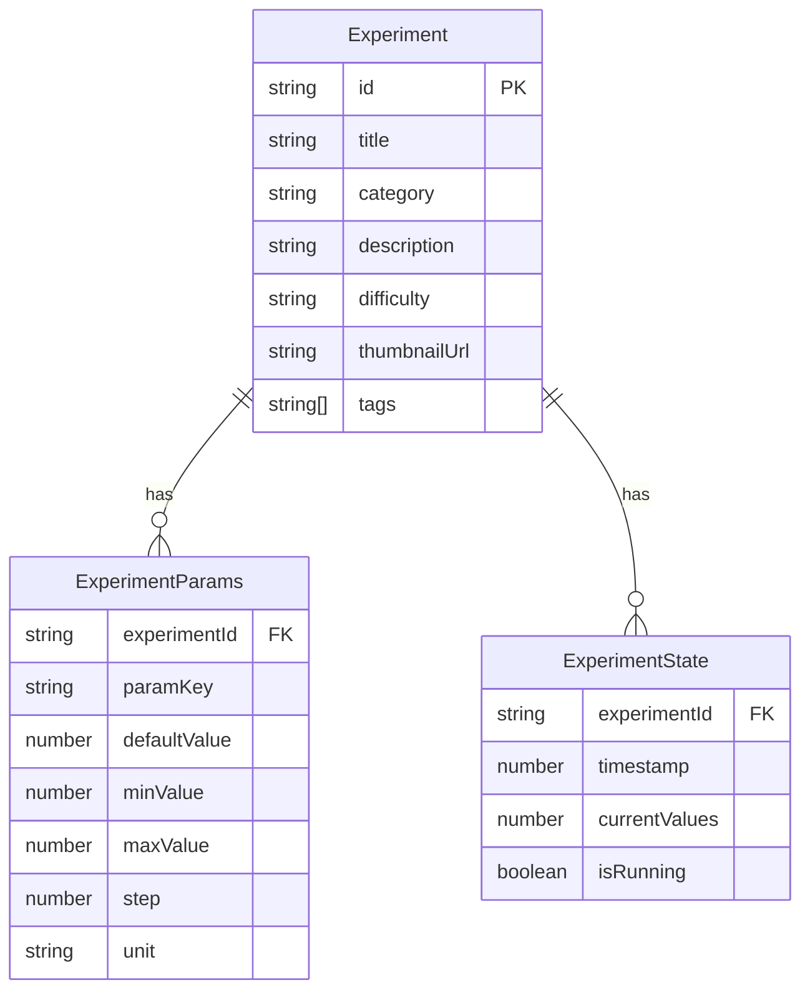
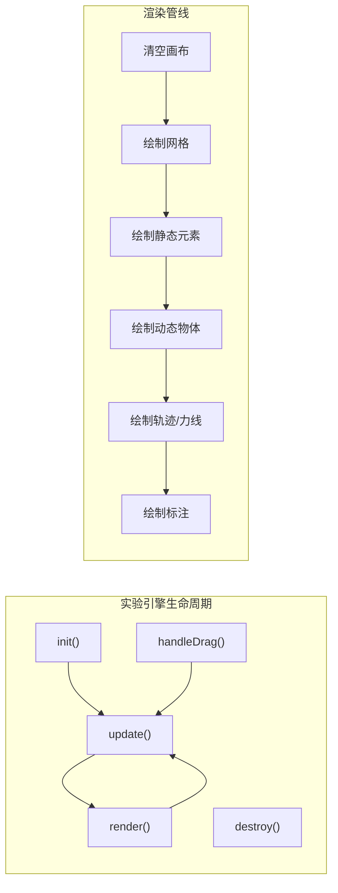

## 1. 架构设计



## 2. 技术说明

- **前端框架**：React@18 + TypeScript
- **样式方案**：TailwindCSS@3 + CSS 变量主题系统
- **构建工具**：Vite
- **状态管理**：Zustand（轻量级，适合实验参数频繁更新场景）
- **Canvas 渲染**：原生 Canvas 2D API（性能最优，无需额外库）
- **公式渲染**：KaTeX（轻量级 LaTeX 渲染，无需服务端）
- **图表**：Chart.js（轻量级数据可视化）
- **动画**：requestAnimationFrame 循环 + CSS 动画
- **路由**：React Router v6
- **后端**：无（纯前端应用，所有计算在客户端完成）
- **数据库**：无（使用 localStorage 保存用户偏好）

## 3. 路由定义

| 路由 | 用途 |
|------|------|
| `/` | 首页 - 实验大厅，展示分类和精选实验 |
| `/lab/:experimentId` | 实验工作台 - 核心交互页面 |
| `/library` | 实验库 - 按学科浏览所有实验 |

## 4. 数据模型

### 4.1 实验数据模型



### 4.2 核心类型定义

```typescript
interface Experiment {
  id: string
  title: string
  category: 'physics' | 'math' | 'chemistry'
  description: string
  difficulty: 'beginner' | 'intermediate' | 'advanced'
  tags: string[]
}

interface ParamConfig {
  key: string
  label: string
  defaultValue: number
  min: number
  max: number
  step: number
  unit: string
}

interface ExperimentEngine {
  init: (canvas: HTMLCanvasElement, params: Record<string, number>) => void
  update: (params: Record<string, number>) => void
  render: (ctx: CanvasRenderingContext2D) => void
  handleDrag: (x: number, y: number, type: 'start' | 'move' | 'end') => void
  destroy: () => void
}
```

## 5. 实验引擎架构

每个实验遵循统一的引擎接口，确保可扩展性：



## 6. 项目文件结构

```
src/
├── components/
│   ├── layout/          # 布局组件
│   ├── canvas/          # Canvas 画布组件
│   ├── controls/        # 参数控制组件（滑块等）
│   ├── formula/         # 公式显示组件
│   └── charts/          # 图表组件
├── engines/             # 实验引擎
│   ├── spring.ts        # 弹簧振子
│   ├── projectile.ts    # 抛体运动
│   ├── wave.ts          # 波干涉
│   └── function.ts      # 函数图像
├── stores/              # Zustand 状态
├── utils/               # 工具函数
├── data/                # 实验配置数据
├── pages/               # 页面组件
└── styles/              # 全局样式与主题变量
```
